# PayslipMax Quick Visual Reference
**All Key Diagrams in One Place**

---

## 🏗️ 1. Complete System Architecture

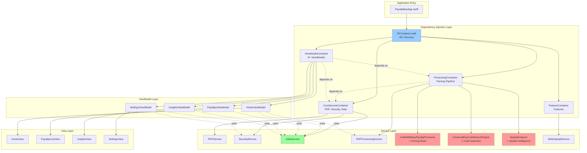

---

## 📄 2. PDF Processing Pipeline (End-to-End)

```mermaid
graph LR
    subgraph "1. User Action"
        UI[👤 User Imports PDF]
    end

    subgraph "2. Handler"
        FIH[FileImportHandler]
    end

    subgraph "3. ViewModel"
        HVM[HomeViewModel<br/>processPDF]
    end

    subgraph "4. Main Service"
        PDFS[PDFProcessingService<br/>processPDFData]
    end

    subgraph "5. Pipeline Execution"
        PPP[PayslipProcessingPipeline]
        VS[1️⃣ ValidationStep<br/>Check password, integrity]
        TES[2️⃣ TextExtractionStep<br/>PDFKit + Vision OCR]
        FDS[3️⃣ FormatDetectionStep<br/>Detect defense format]
        PS[4️⃣ ProcessingStep<br/>Parse data]
    end

    subgraph "6. Parsing"
        UMP[UnifiedMilitaryPayslipProcessor]
        UPCS[Universal Search<br/>40+ codes]
        SA[Spatial Analysis<br/>Table detection]
    end

    subgraph "7. Result"
        PI[✅ PayslipItem<br/>100% Accuracy]
        DS[DataService.save<br/>SwiftData]
    end

    UI --> FIH
    FIH --> HVM
    HVM --> PDFS
    PDFS --> PPP
    PPP --> VS
    VS --> TES
    TES --> FDS
    FDS --> PS
    PS --> UMP
    UMP --> UPCS
    UMP --> SA
    UPCS --> PI
    SA --> PI
    PI --> DS

    style UI fill:#ffcccc
    style PI fill:#ccffcc
    style UMP fill:#ff9999
    style UPCS fill:#ff9999
    style SA fill:#ff9999
```

---

## 🔍 3. Five-Layer Parsing Architecture

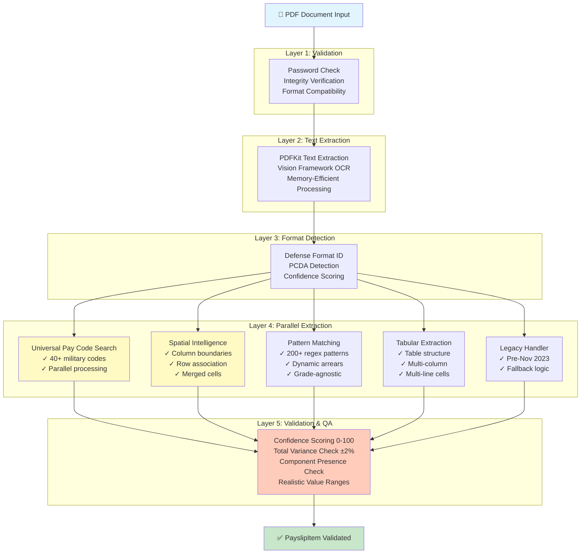

---

## 🧠 4. Parsing Intelligence Layer

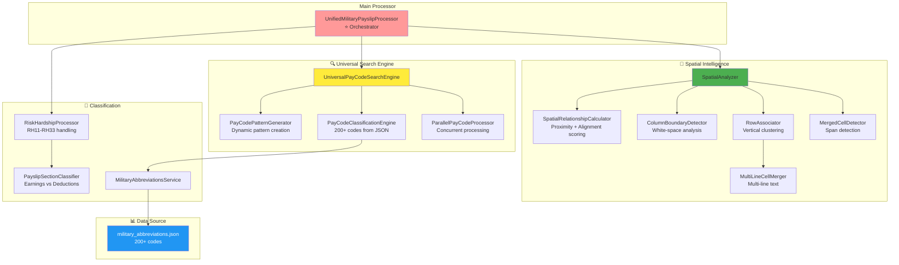

---

## 🏠 5. Home Feature Module Architecture

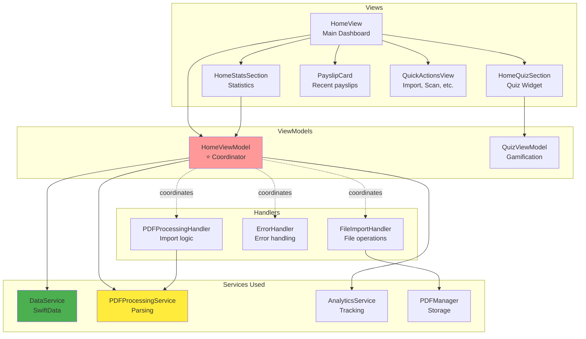

---

## 📊 6. Insights Feature Module

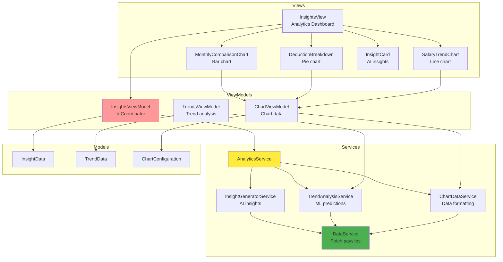

---

## 🔐 7. Security Architecture

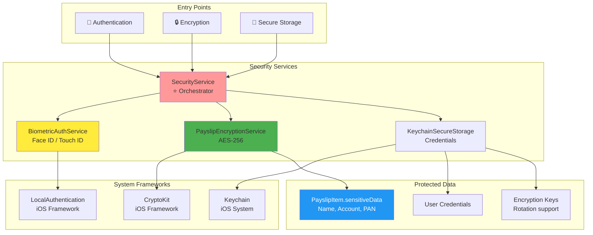

---

## 🧪 8. Testing Architecture

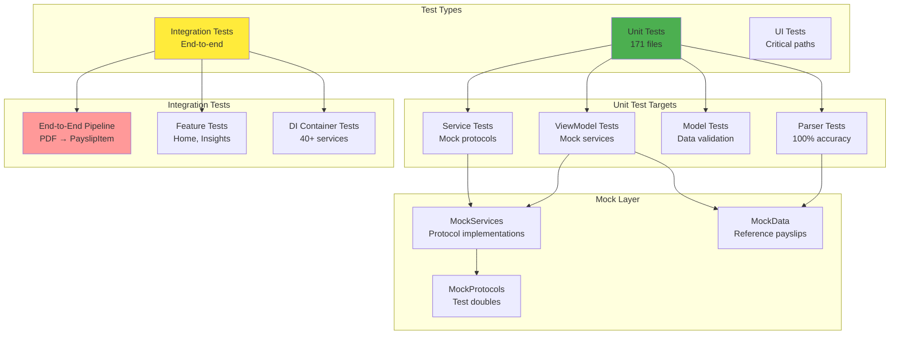

---

## 🔄 9. Data Flow Sequence (PDF Import)

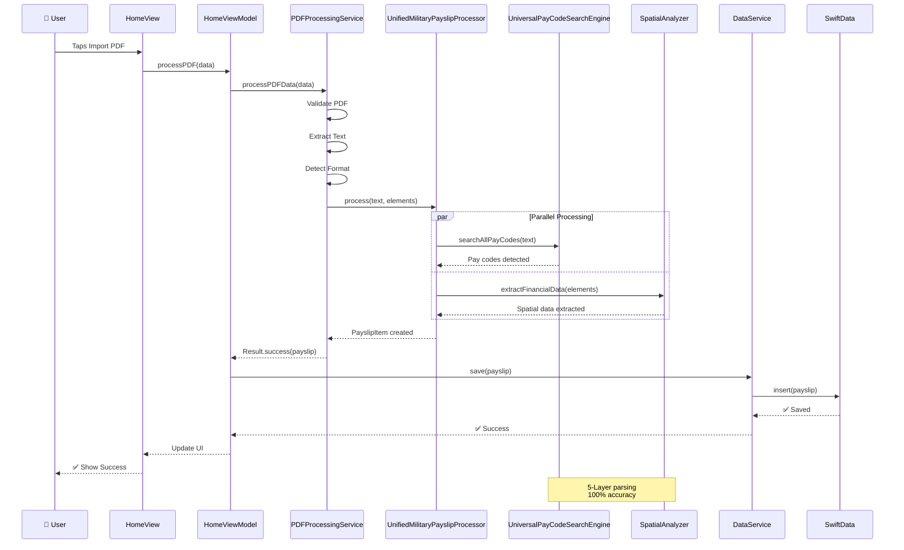

---

## 🎯 10. Critical Path: App Launch

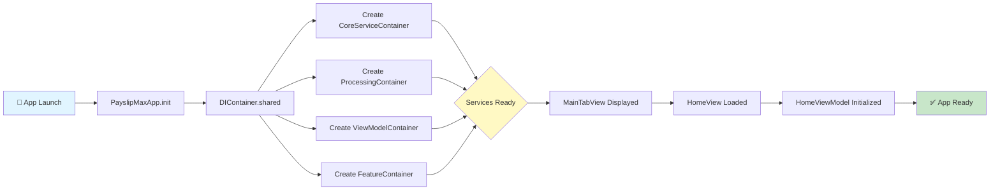

---

## 📦 11. Module Dependency Matrix

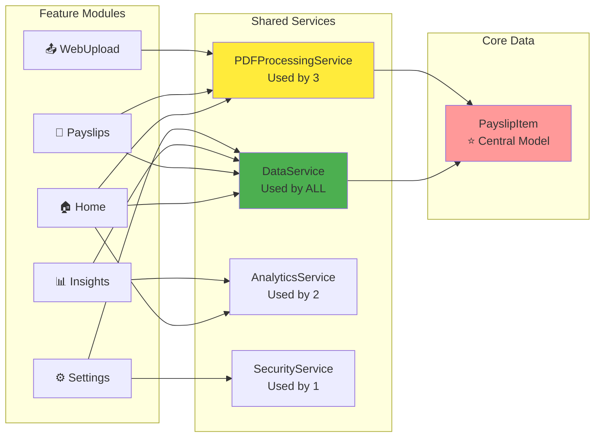

---

## 📊 12. File Distribution

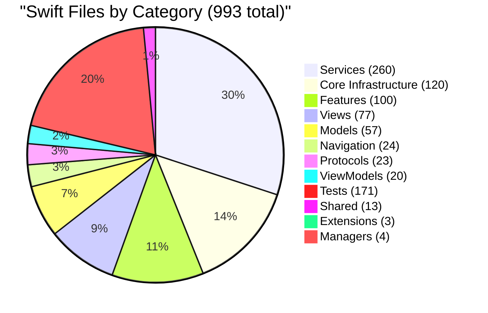

---

## 🎓 Legend

**Color Code**:
- 🔴 Red/Pink: Critical files (Parsers, ViewModels, Orchestrators)
- 🟡 Yellow: Search & Detection engines
- 🟢 Green: Data & Storage services
- 🔵 Blue: External data sources (JSON, System frameworks)

**Symbols**:
- ⭐ Star: Core/Central component
- 👤 Person: User interaction point
- ✅ Checkmark: Success/Validation point
- 🔐 Lock: Security-related
- 📊 Chart: Analytics/Insights
- 🏠 House: Home feature
- 📄 Document: Payslip-related

---

## 📝 Quick Reference

**Most Important Diagrams**:
1. **#1** - Complete System Architecture (understand overall structure)
2. **#2** - PDF Processing Pipeline (understand core value proposition)
3. **#4** - Parsing Intelligence Layer (understand 100% accuracy achievement)
4. **#9** - Data Flow Sequence (understand execution flow)

**For Developers**:
- New to project? Start with **#1, #2**
- Adding feature? See **#5, #6, #7** (feature modules)
- Debugging parsing? See **#3, #4** (parsing layers)
- Understanding security? See **#7** (security architecture)

---

**Tip**: Your Mermaid plugin should render these diagrams automatically!
If not, check plugin settings or copy to https://mermaid.live/

