# PayslipMax Visual Dependency Map
**Interactive diagrams showing file relationships**

---

## 🎯 Core Architecture Diagram

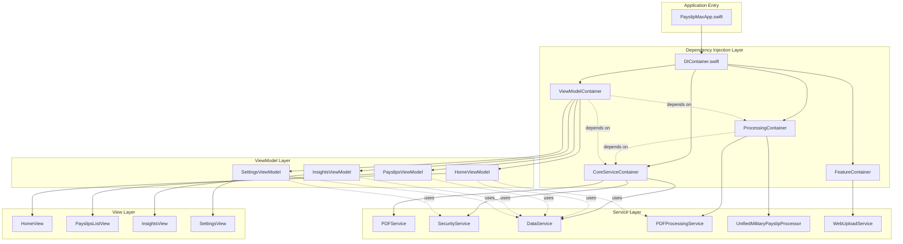

---

## 📄 PDF Processing Pipeline

```mermaid
graph LR
    subgraph "User Action"
        UI[User Imports PDF]
    end

    subgraph "Handler Layer"
        FIH[FileImportHandler]
    end

    subgraph "ViewModel Layer"
        HVM[HomeViewModel]
    end

    subgraph "Service Layer"
        PDFS[PDFProcessingService]
        PPP[PayslipProcessingPipeline]
    end

    subgraph "Pipeline Steps"
        VS[ValidationStep]
        TES[TextExtractionStep]
        FDS[FormatDetectionStep]
        PS[ProcessingStep]
    end

    subgraph "Processing"
        UMP[UnifiedMilitaryPayslipProcessor]
        UPCS[UniversalPayCodeSearchEngine]
        SA[SpatialAnalyzer]
    end

    subgraph "Result"
        PI[PayslipItem]
        DS[DataService.save]
    end

    UI --> FIH
    FIH --> HVM
    HVM --> PDFS
    PDFS --> PPP
    PPP --> VS
    VS --> TES
    TES --> FDS
    FDS --> PS
    PS --> UMP
    UMP --> UPCS
    UMP --> SA
    UPCS --> PI
    SA --> PI
    PI --> DS
```

---

## 🔍 Parsing Layer Dependencies

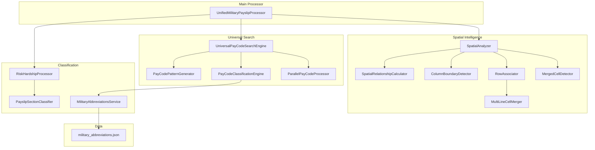

---

## 🏠 Home Feature Module

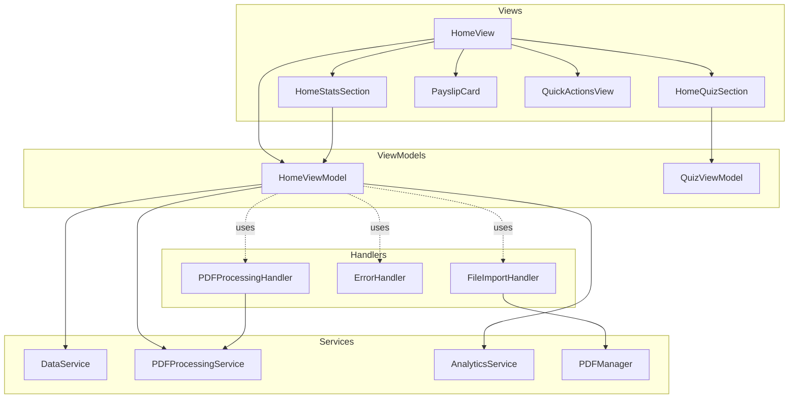

---

## 📊 Insights Feature Module

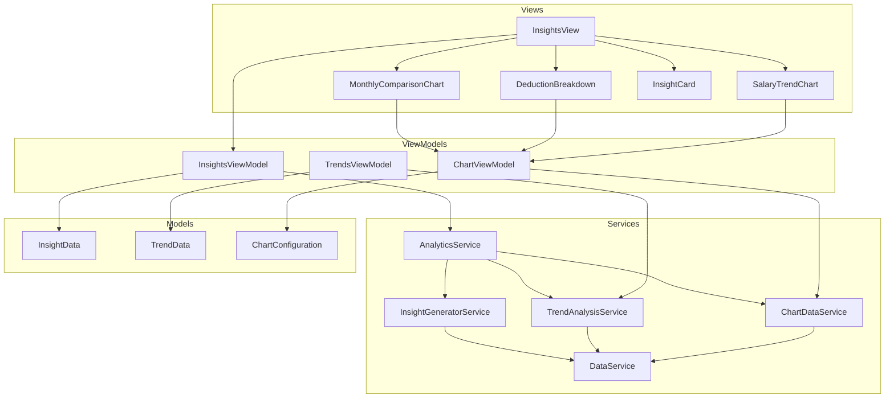

---

## ⚙️ Settings Feature Module

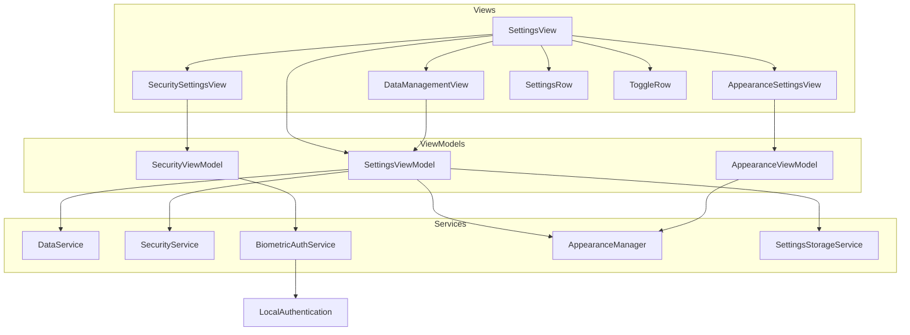

---

## 📱 Feature Module Interactions

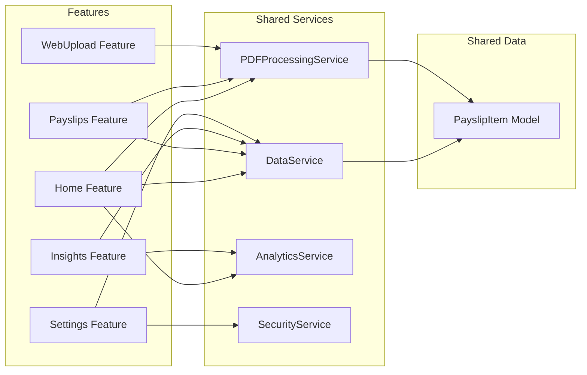

---

## 🧪 Testing Architecture

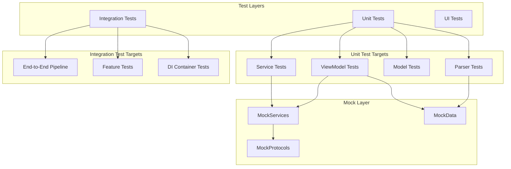

---

## 🔐 Security Layer

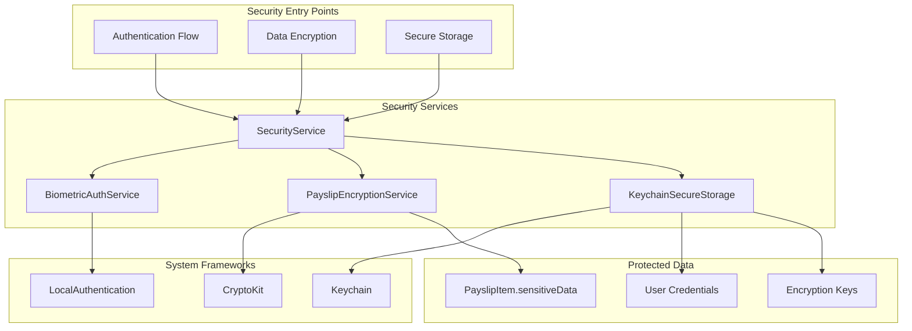

---

## 📦 Data Flow Architecture

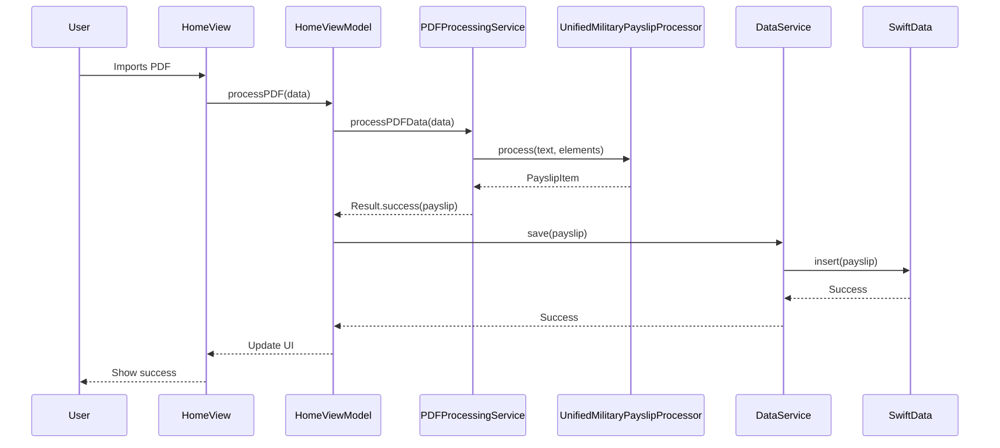

---

## 🎯 Critical Paths

### Path 1: App Launch to Ready State

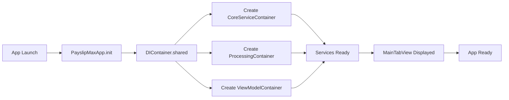

### Path 2: PDF Import to Saved Payslip

```mermaid
graph LR
    A[User Selects PDF] --> B[FileImportHandler]
    B --> C[HomeViewModel.processPDF]
    C --> D[PDFProcessingService]
    D --> E[Pipeline Execution]
    E --> F[UnifiedMilitaryPayslipProcessor]
    F --> G[PayslipItem Created]
    G --> H[DataService.save]
    H --> I[SwiftData Persistence]
    I --> J[UI Updated]
```

### Path 3: View Payslip Details

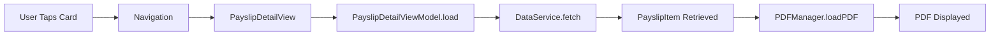

---

## 🔗 Module Dependency Matrix

| Module | Core DI | PDF Service | Data Service | Security | Analytics |
|--------|---------|-------------|--------------|----------|-----------|
| **Home** | ✅ | ✅ | ✅ | ❌ | ✅ |
| **Payslips** | ✅ | ✅ | ✅ | ❌ | ❌ |
| **Insights** | ✅ | ❌ | ✅ | ❌ | ✅ |
| **Settings** | ✅ | ❌ | ✅ | ✅ | ❌ |
| **WebUpload** | ✅ | ✅ | ❌ | ❌ | ❌ |
| **Authentication** | ✅ | ❌ | ❌ | ✅ | ❌ |
| **Backup** | ✅ | ✅ | ✅ | ❌ | ❌ |

---

## 📊 File Count by Category

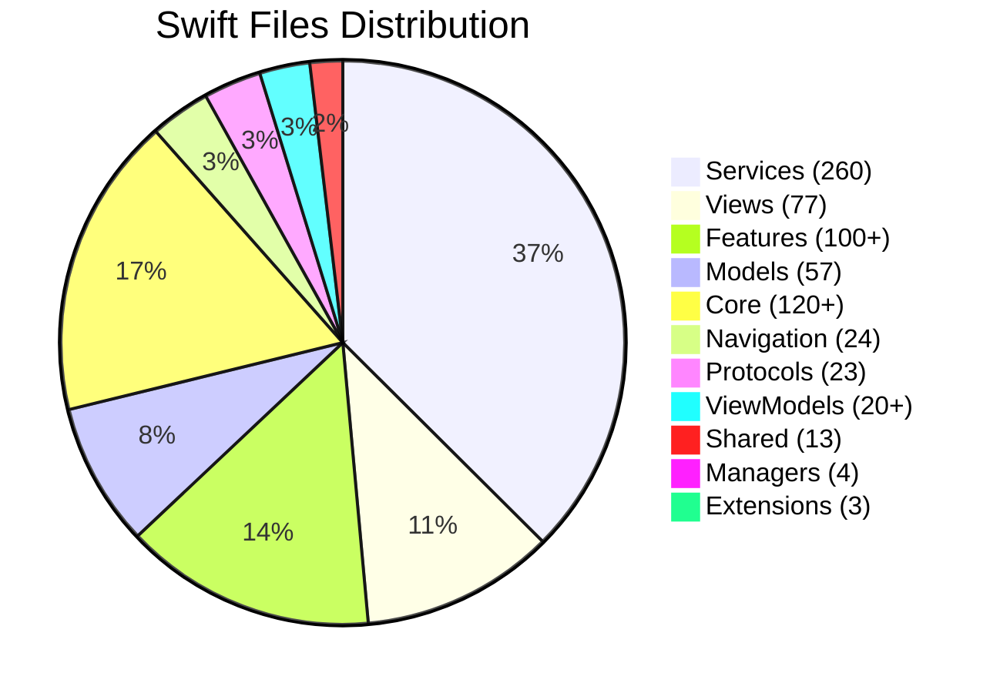

---

## 🎭 Protocol Hierarchy

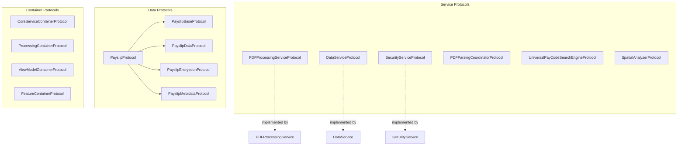

---

## 🚀 Performance Monitoring Flow

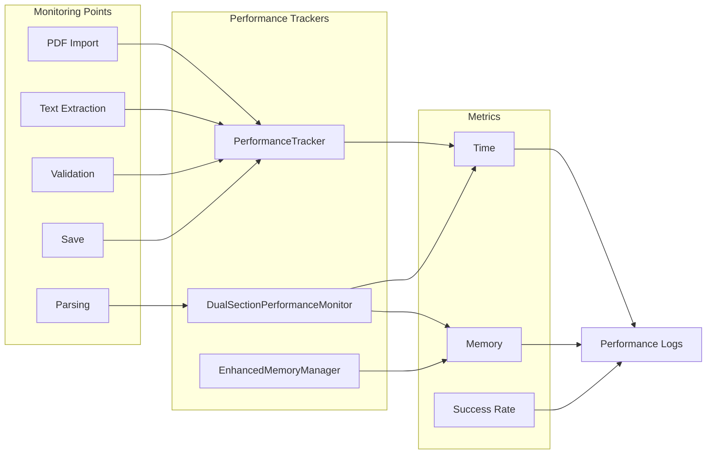

---

## 📝 Summary

### Key Insights

1. **4-Layer DI Architecture**
   - Clear separation: Core → Processing → ViewModel → Feature
   - Protocol-first design enables testability

2. **Service Dependencies**
   - DataService: Used by every ViewModel
   - PDFProcessingService: Core value proposition
   - UnifiedMilitaryPayslipProcessor: Parsing brain

3. **Feature Independence**
   - Each feature module is self-contained
   - Shared services accessed via DI
   - No cross-feature dependencies

4. **MVVM Compliance**
   - Views only know ViewModels
   - ViewModels coordinate Services
   - Services never import SwiftUI

5. **Testing Strategy**
   - Protocols enable mocking
   - DI supports test injection
   - Integration tests validate full pipeline

---

**For Interactive Viewing:**
Copy any Mermaid diagram into [Mermaid Live Editor](https://mermaid.live/) for interactive exploration.

